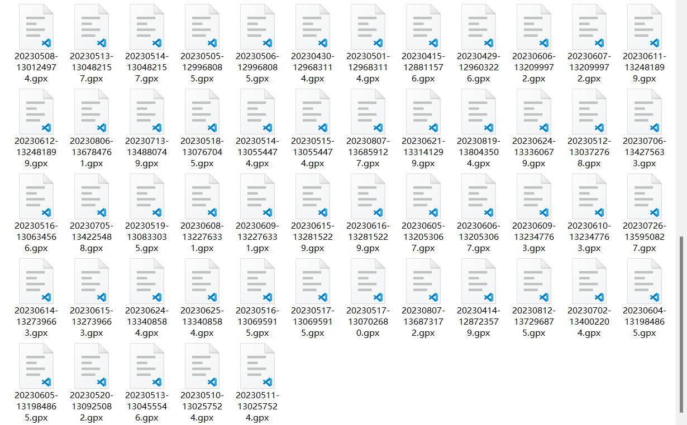
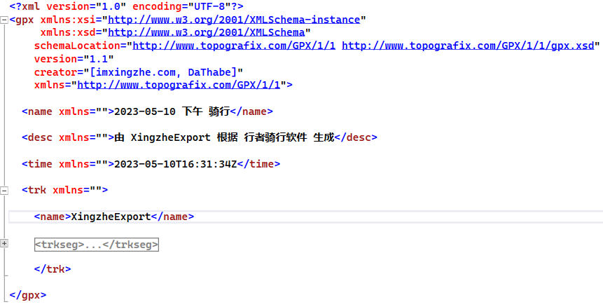
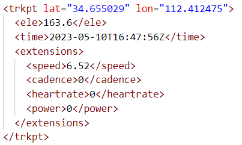

# 行者运动数据导出工具

## 问答

### 什么是行者?  

- [官网](https://www.imxingzhe.com/)是这样写的「行者，专业户外运动软件」

### 为什么写这个工具?  

- 在浏览行者网页端时，我发现可以导出 GPX 文件，其中包含了我的运动记录。我想将这些记录上传到 [Strava](https://www.strava.com/) ,于是这个工具出现了

### 是怎么导出的?

- 模拟网页版行者进行API请求

- 需要登录之后获取自己的 Cookie 才能使用

### 都能导出什么?  

- **经纬度**: 你的运动轨迹

- **海拔(m)**: 你的海拔高度

- **速度(m/s)**: 你的运动速度

- **心率(bpm)**: 如果你有心率传感器

- **踏频(rpm)**: 如果你有踏频传感器

- **功率(w)**: 如果你有功率计

### 导出的数据是什么格式?  

- **[GPX 1.1](https://www.topografix.com/GPX/1/1/)** 格式的 XML 文档。这个格式是通用的运动数据交换格式

- 我还在疑惑 心率,功率,踏频 怎么合并到一起上传 Strava 时

- 查询到了这个项目 **[xingzhe-gpx-processor](https://github.com/Harry-Chen/xingzhe-gpx-processor/blob/master/merge.py)**

- 得知了以下写法, 非常感谢

## 安装和配置

- 克隆或下载本仓库

- 编译并运行应用程序

- 按照程序提示进行操作

## 使用方法

> 没有使用命令行交互，提供了一个简单的菜单选项  

- 选择 Cookie 管理

- 选择 添加 

- 输入你的 Cookie

- 返回到程序主菜单

- 选择 开始同步

- 选择要同步的用户名

- 等待完成

## 篇末

- 如果你有任何问题或建议，请随时联系我

- 辣鸡代码, 大伙看个乐